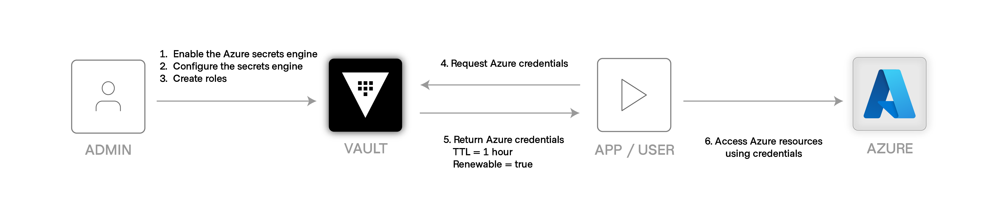

# Vault Dynamic Secrets

## Azure



1. For the first time, change to the `azure/create` directory.
2. Run the `terraform plan` / `terraform apply`.
3. Then make sure an Enterprise Administrator grants the consent for the API permissions.
4. Then change to the `azure/execute` directory.
5. Run the `terraform plan` / `terraform apply`.
6. Enable the Azure secrets engine in Vault.

   ```shell
   vault secrets enable azure
   ```

7. Read the Terraform outputs and write the Azure config to Vault.

   ```shell
   vault write azure/config \
     subscription_id=$SUBSCRIPTION_ID  \
     client_id=$CLIENT_ID \
     client_secret=$CLIENT_SECRET \
     tenant_id=$TENANT_ID \
     use_microsoft_graph_api=true
   ```

8. Create an Azure role in Vault.

   ```shell
   vault write azure/roles/vault-fundamentals ttl=1h azure_roles=-<<EOF
     [
       {
         "role_name": "Contributor",
         "scope":  "/subscriptions/$SUBSCRIPTION_ID/resourceGroups/$RESOURCE_GROUP"
       }
     ]
   EOF
   ```

9. Create a policy in Vault, allowing access to retrieve credentials.

   ```shell
   vault policy write pol-vault-fundamentals - << EOF
   path "azure/creds/vault-fundamentals" {
     capabilities = ["read"]
   }

   path "azure/config" {
     capabilities = ["read"]
   }

   path "auth/token/create" {
     capabilities = ["create", "read", "update", "list"]
   }
   EOF
   ```

10. Create a Vault token that is issued the policy.

   ```shell
   vault token create \
     -no-default-policy=true
     -orphan=true
     -policy=pol-vault-fundamentals
   ```

11. Now you should be able to read Azure credentials from Vault.

   Through CLI

   ```shell
   vault read azure/creds/vault-fundamentals
   ```

   Through `curl`

   ```shell
   curl -s -H "X-Vault-Token: $VAULT_TOKEN" $VAULT_ADDR/v1/azure/creds/vault-fundamentals | jq -r .data
   ```

   Or through Terraform

   ```shell
   cd azure/read
   terraform plan
   terraform apply
   ```

12. Log in to Azure with your new credentials.

   Through CLI

   ```shell
   az login --service-principal -u <app-id> -p <password-or-cert> --tenant <tenant>
   ```
